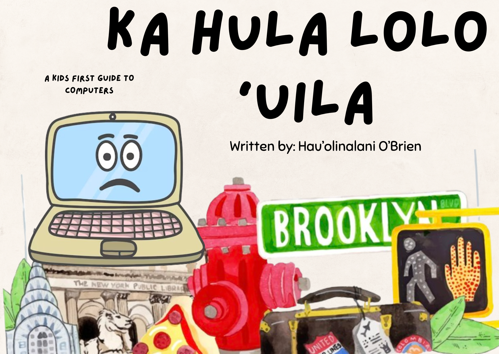

While not another Full-Stack web application, my heritage and culture are significant to me in ways that I could not even begin to explain. Equally important is my education as a Native Hawaiian student, which I am beyond proud and grateful to be endowed with, and believe that every student should have the opportunity to do so, starting at any age, regardless of personal circumstances that they think may potentially prohibit them.

<pre>
Over the past year, my mother and I have been working on a children’s book that introduces grade school students to the idea of technology, computers, and Computer Science, and plants the idea that they’re capable of using technology to their advantage, for their education. “Ka hula lolo ‘uila” or, the dancing computer, follows the story of a computer named ʻAʻapo who travels and dances his way across the world, eager to show people his abilities. Throughout the book, ʻAʻapo goes along showing everyone how he can play fun games, draw colorful pictures, talk to his friends, write stories, and store important documents and information, all within his own system! He explains that he can even help doctors, emergency responders, and scientists solve big puzzles that help them do their jobs to make the world a better place.

The aim of our book is to help students identify how simple items and objects they see or may be curious about from a young age are useful to the real world, and are useful to their lives! Even as young students, technology, in moderation and under supervision is crucial to their education and can be a vital tool for learning. By crucial, I mean significantly impactful to learn and open their creative and innovative minds, NOT merely throwing them on an iPad senselessly for hours. 

Throughout the process of working on Ka hula lolo ‘uila, I’ve also been able to integrate ʻŌlelo Hawaiʻi (Hawaiian language) into the story that introduces the language to readers without pushing it onto them, or forcing them to learn it. I’ve also used the book as an opportunity to open my own creative outlet, which allows me to perpetuate ‘Computer Science’ without directly programming or looking at lines of code for hours. It allows me to have fun, while feeling happy about potentially educating others through my book. 

</pre>

