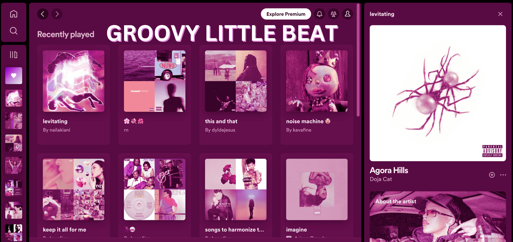

Immerse yourself in the ultimate music experience with Groovy Little Beat, a web application that streamlines Spotify’s design and makes listening to music, a lot less boring, and a little more Groovy.

Developed in 99% TypeScript, Funky Little Beat utilizes
Next.js, React, and Supabase to create a responsive and dynamic user interface which
allows users to sign up, listen to music of their choice, add music to playlists and libraries,
upload new music, adjust the sound, and more. 

<pre>
As I'm still developing the web application, here are a few Groovy additions you can expect to be implemented soon:
- Stripe integration
- Supabase and PostgreSQL Database handling
- Multiple device log in
 - Credential authentication
- File and image upload for personal tracks and Groovy account using Supabase 
- Favorite song filing system
- Stripe recurring payment option
- Cancelling Stripe subscriptions

Source: <a href="https://github.com/hauolinalani/spotify-clone.git"><i class="large github icon "></i>hauolinalani/spotify-clone</a>
