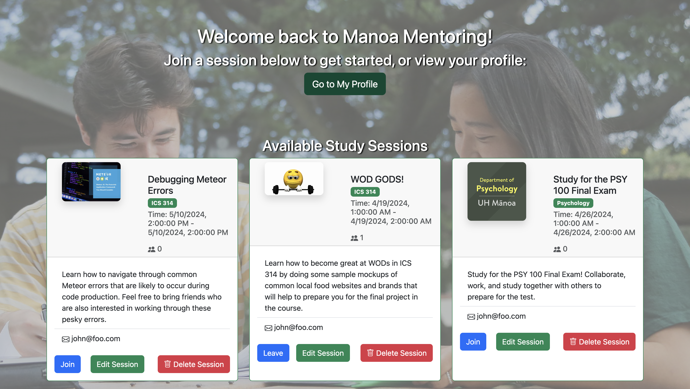

Students at UH Manoa may encounter difficulties while studying, doing homework, or with their overall academic performance. There are a number of reasons why a student may be struggling, such as personal challenges or rigorous coursework, but one common issue is not having the proper resources to seek help.

Our application, Manoa Mentoring, aims to bring together students and mentors. Students can match themselves with other students who are facing similar issues, or they can choose a mentor who specializes in a subject or course they are taking. Through Manoa Mentoring, our goal is to create a space where students can not only receive the support they need, but also foster connections through mentorship and potential friendships.

<pre>
Alongside Roger Tulonghari, Grace Madson, Robert Maddox and Hazelle Limos,
  we designed Manoa Mentoring in hopes of encouraging people to find common interests with others,
  whether that be through studying for the same class, learning a new language, or even creating a
  session to learn more about your personal hobbies. The idea is that students can browse the profiles
  of other students and mentors and view available sessions or create their own, to nuture an environment 
  they feel comfortable in, and want to learn in. My role in the creation of Manoa Mentoring was predominately 
  intergrating cohesive designs that were welcoming, appropriate and cohesive to the overall objective of the 
  website while also using frameworks like Meteor. Additionally, I developed the "Session" collection and session 
  pages which allows users to view, create, join, and edit sessions condusively. Through working on this project, 
  I was able to utilize multiple frameworks while also honing in on my JavaScript skills. More importantly,
  I learned how to work with a team and collaborate to be productive while also experiencing errors while developing, 
  ultimately allowing me to understand how to fix errors and prevent them from happening again. 

Source: <a href="https://manoa-mentoring.github.io/"><i class="large github icon "></i>manoam-mentoring/manoamentoring</a>
